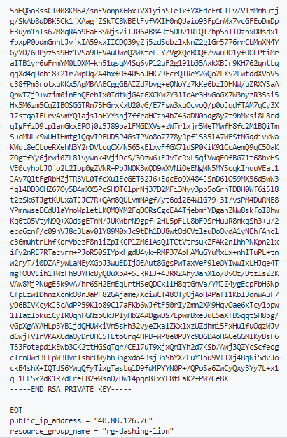
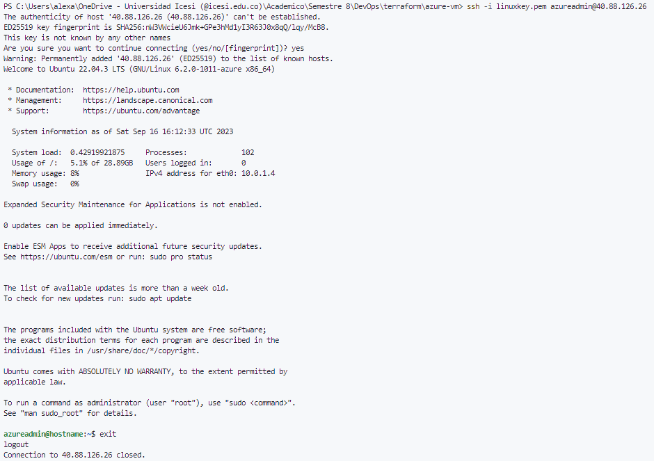
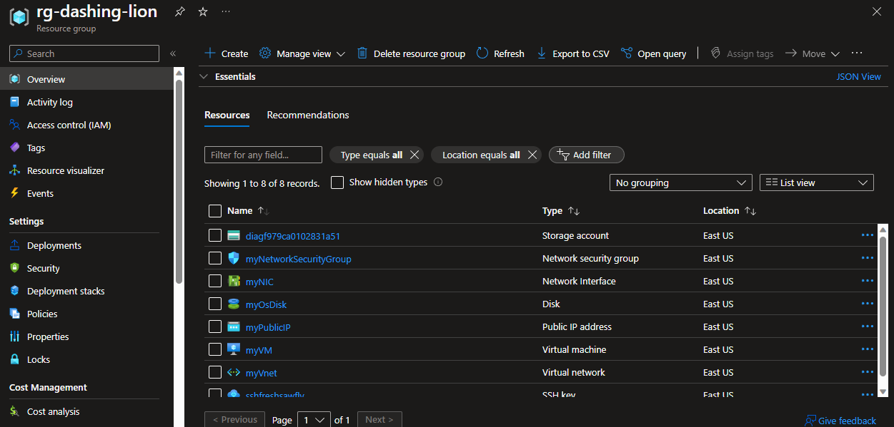
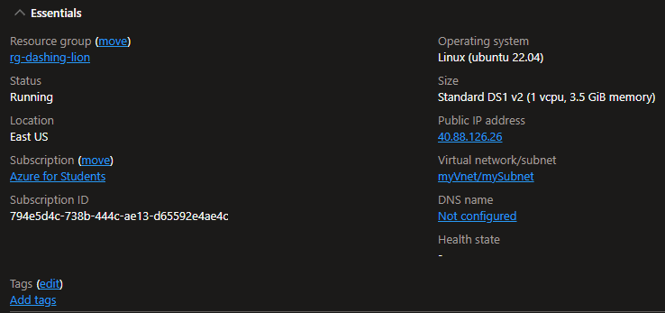

# Azure Virtual Machine Deployment with Terraform

This repository contains Terraform configuration files to deploy an Azure Virtual Machine (VM). The deployment process involves creating various Azure resources and configuring a VM for your use and ssh connection capacity.

## Prerequisites

Before you begin, make sure you have the following prerequisites:

1. [Terraform](https://www.terraform.io/downloads.html) installed.
2. An Azure subscription.
3. Azure CLI installed and authenticated.

## Getting Started

Follow these steps to deploy an Azure VM:

1. Clone this repository to your local machine.

2. Navigate to the repository directory.

3. Run the following command to initialize Terraform:

    ```bash
    terraform init
    ```
4. Validate the Terraform configuration files:

    ```bash
    terraform validate
    ```
5. Run the following command to deploy the Azure resources:

    ```bash
    terraform apply
    ```
6. Once the deployment is complete, you can establish a ssh connection to the VM using the following command:

    ```bash
    ssh -i linuxkey.pem azureuser@<public-ip-address>
    ```
Being the `<public-ip-address>` the public IP address of the VM generated by Azure 

## Code

The Terraform configuration files are organized as follows:
    
```
├── main.tf
├── variables.tf
├── outputs.tf
├── ssh.tf
├── providers.tf
├── linuxkey.pem 
```

Where `linyxkey.pem` is the private key generated by Microsoft service and stored as a file in the repository.

We are going to deep dive in the content of the essential files as follows:

### main.tf

This file contains the Terraform configuration to deploy the Azure resources. The resources deployed are:

- A resource group.

    ```terraform
    resource "azurerm_resource_group" "rg" {
    location = var.resource_group_location
    name     = random_pet.rg_name.id
    }
    ```

- A virtual network.

    ```terraform
    resource "azurerm_virtual_network" "my_terraform_network" {
    name                = "myVnet"
    address_space       = ["10.0.0.0/16"]
    location            = azurerm_resource_group.rg.location
    resource_group_name = azurerm_resource_group.rg.name
    }
    ```

- A subnet.

    ```terraform
    resource "azurerm_subnet" "my_terraform_subnet" {
    name                 = "mySubnet"
    resource_group_name  = azurerm_resource_group.rg.name
    virtual_network_name = azurerm_virtual_network.my_terraform_network.name
    address_prefixes     = ["10.0.1.0/24"]
    }
    ```

- A public IP address.

    ```terraform
    resource "azurerm_public_ip" "my_terraform_public_ip" {
    name                = "myPublicIP"
    location            = azurerm_resource_group.rg.location
    resource_group_name = azurerm_resource_group.rg.name
    allocation_method   = "Dynamic"
    }   
    ```

- A network interface.

    ```terraform
    resource "azurerm_network_interface" "my_terraform_nic" {
    name                = "myNIC"
    location            = azurerm_resource_group.rg.location
    resource_group_name = azurerm_resource_group.rg.name

        ip_configuration {
            name                          = "my_nic_configuration"
            subnet_id                     = azurerm_subnet.my_terraform_subnet.id
            private_ip_address_allocation = "Dynamic"
            public_ip_address_id          = azurerm_public_ip.my_terraform_public_ip.id
        }
    }
    ```

- A network security group.

    ```terraform
    resource "azurerm_network_security_group" "my_terraform_nsg" {
    name                = "myNetworkSecurityGroup"
    location            = azurerm_resource_group.rg.location
    resource_group_name = azurerm_resource_group.rg.name

        security_rule {
            name                       = "SSH"
            priority                   = 1001
            direction                  = "Inbound"
            access                     = "Allow"
            protocol                   = "Tcp"
            source_port_range          = "*"
            destination_port_range     = "22"
            source_address_prefix      = "*"
            destination_address_prefix = "*"
        }
    }
    ```

- A virtual machine.

    ```terraform
    resource "azurerm_linux_virtual_machine" "my_terraform_vm" {
    name                  = "myVM"
    location              = azurerm_resource_group.rg.location
    resource_group_name   = azurerm_resource_group.rg.name
    network_interface_ids = [azurerm_network_interface.my_terraform_nic.id]
    size                  = "Standard_DS1_v2"

        os_disk {
            name                 = "myOsDisk"
            caching              = "ReadWrite"
            storage_account_type = "Premium_LRS"
        }

        source_image_reference {
            publisher = "Canonical"
            offer     = "0001-com-ubuntu-server-jammy"
            sku       = "22_04-lts-gen2"
            version   = "latest"
        }

        computer_name  = "hostname"
        admin_username = var.username

        admin_ssh_key {
            username   = var.username
            public_key = jsondecode(azapi_resource_action.ssh_public_key_gen.output).publicKey
        }

        boot_diagnostics {
            storage_account_uri = azurerm_storage_account.my_storage_account.primary_blob_endpoint
        }
    }    
    ```

### ssh.tf

This file contains the Terraform configuration to generate a ssh key pair. The key pair is generated using the Azure API and stored as a Terraform output.

```terraform
resource "random_pet" "ssh_key_name" {
    prefix    = "ssh"
    separator = ""
}

resource "azapi_resource_action" "ssh_public_key_gen" {
    type        = "Microsoft.Compute/sshPublicKeys@2022-11-01"
    resource_id = azapi_resource.ssh_public_key.id
    action      = "generateKeyPair"
    method      = "POST"

    response_export_values = ["publicKey", "privateKey"]
}

resource "azapi_resource" "ssh_public_key" {
    type      = "Microsoft.Compute/sshPublicKeys@2022-11-01"
    name      = random_pet.ssh_key_name.id
    location  = azurerm_resource_group.rg.location
    parent_id = azurerm_resource_group.rg.id
}

output "key_data" {
    value = jsondecode(azapi_resource_action.ssh_public_key_gen.output).publicKey
}

output "key_data_private" {
    value = jsondecode(azapi_resource_action.ssh_public_key_gen.output).privateKey
}

resource "local_file" "linuxkey" {
    filename="linuxkey.pem"  
    content=jsondecode(azapi_resource_action.ssh_public_key_gen.output).privateKey
}
```

## Execution

### Terraform

When `terraform apply` is executed, Terraform reads the configuration files in the current directory and generates an execution plan. The execution plan describes the actions that Terraform will take to deploy the resources specified in the configuration files and outputs the plan to the console.

Outputs are shown below:



Here we can see the public IP address of the VM. This IP address is used to establish a ssh connection to the VM. Also we can see the private key generated by Azure and stored as a file in the repository. Finally, it can be appreciated the resource group name.

### SSH Connection

When VM is deployed and we have the public IP address, we can establish a ssh connection to the VM using the following command:

```bash
ssh -i linuxkey.pem azureuser@<public-ip-address>
```



And we can see the VM is up and running.

### Azure Portal

To see the resources deployed in Azure, we can go to the Azure Portal and navigate to the resource group created by Terraform.



Also, we can see the VM's essential info



## Clean Up

To clean up the resources created by Terraform, run the following command:

```bash
terraform destroy
```

## Tools

<a href="https://www.terraform.io/">
    
</a>
<a href="https://azure.microsoft.com/en-us">
    
</a>
<a href="https://code.visualstudio.com/">
    
</a>
<a href="https://git-scm.com/">
    
</a>


